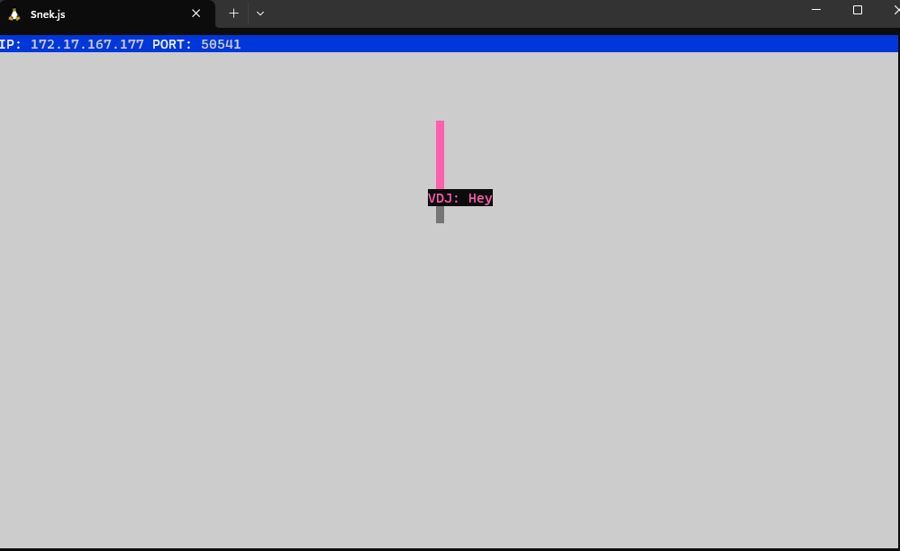

# Snake Client Project

Snake Client is a multiplayer version of the classic snake game. It is a video game concept where players maneuver a dot and grow it by eating pieces of food. As the dot moves and eats, it grows, presenting a challenge to avoid colliding with the walls or its own body. The goal is to grow the dot as big as possible without bumping into obstacles, aiming for the highest score.



## Features

- Multiplayer functionality
- Real-time updates
- Customizable player name
- Simple terminal-based interface

## Getting Started

To run the Snake Client, you need to have the Snake Server running. Follow the steps below to set up and start playing:

### Prerequisites

- Node.js installed on your machine
- Snake Server installed and running


### Usage

1. Start the Snake Server by following the instructions in the [Snake Server repository](https://github.com/lighthouse-labs/snek-multiplayer.git).
2. Open a terminal and navigate to the project directory.
3. Run the Snake Client using the following command (make sure to change XYZ to any 3 letter name you desire):

   ```bash
   node play.js "XYZ"